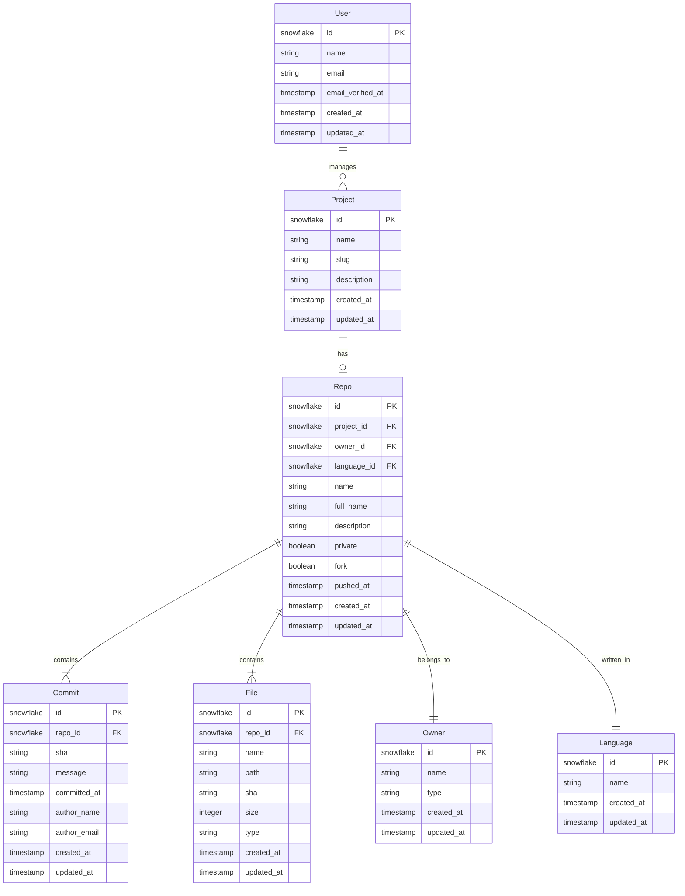

# Project API

A Laravel 11-based microservice for tracking GitHub repository data and project management. Built with Filament admin panel for easy data visualization and management.

## Current Implementation

- **Admin Interface**: Built with Filament, providing real-time repository insights
- **GitHub Integration**: Tracks repositories, commits, and file changes
- **Activity Logging**: Monitors project and repository activities
- **Project Management**: Handles project metadata and repository relationships

## Data Structure

## Current Features

### Admin Panel (Filament)
- Project management with repository associations
- Commit history visualization
- File tracking and management
- User management
- Repository insights

### Core Functionality
- Snowflake IDs for distributed scalability
- Activity logging on all models
- Slug-based routing for projects
- Relationship management between projects and repositories

## Tech Stack

- **Framework**: Laravel 11
- **Admin Panel**: Filament
- **Database**: MySQL/PostgreSQL
- **Authentication**: Laravel Sanctum
- **Activity Logging**: Spatie Activity Log
- **ID Generation**: Snowflake IDs

## Getting Started

1. Clone the repository
2. Install dependencies: `composer install`
3. Copy .env.example: `cp .env.example .env`
4. Generate application key: `php artisan key:generate`
5. Configure database in .env
6. Run migrations: `php artisan migrate`
7. Serve application: `php artisan serve`

## Contributing

1. Fork the repository
2. Create a feature branch
3. Commit your changes
4. Push to the branch
5. Create a Pull Request