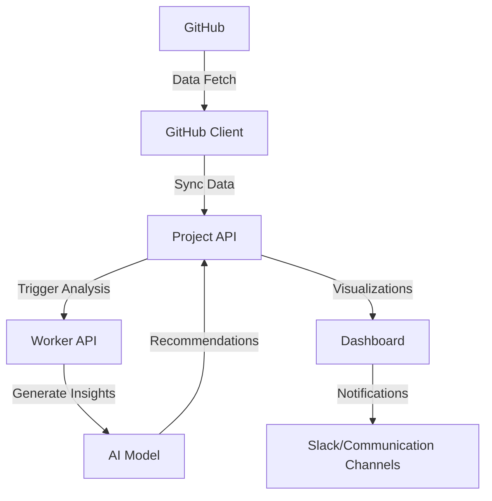

# Project Ecosystem: Integrated Development Intelligence Platform

## Vision Overview
A holistic, AI-powered project management and development intelligence system that seamlessly integrates multiple technologies and provides deep insights into software development workflows.

## Core Components

### 1. Project API (Central Intelligence Hub)
- **Purpose**: Centralized project management and analysis platform
- **Technologies**: Laravel, PHP
- **Key Features**:
  - Comprehensive GitHub repository tracking
  - Multi-language project insights
  - AI-driven project recommendations
  - Custom artisan commands for project analysis

### 2. GitHub Client
- **Purpose**: GitHub data extraction and synchronization
- **Technologies**: PHP
- **Core Functionality**:
  - Detailed repository language breakdown
  - Metadata collection
  - Sync mechanisms for project-api

### 3. Worker API
- **Purpose**: Background processing and advanced computations
- **Potential Technologies**: Python, Celery, RabbitMQ
- **Responsibilities**:
  - Async task processing
  - Machine learning model training
  - Advanced data analysis
  - Complex computational tasks

### 4. AI System Architecture

## Integrated Workflow

1. **Data Collection**
   - GitHub Client extracts repository details
   - Project API stores and processes data
   - Worker API performs complex analyses

2. **Insight Generation**
   - AI models analyze development patterns
   - Generate personalized project recommendations
   - Track language usage, project complexity

3. **Visualization & Communication**
   - Interactive dashboards
   - Slack/communication channel integrations
   - Real-time project health monitoring

## Technology Stack
- **Backend**: Laravel, PHP
- **Data Processing**: Python
- **Frontend**: Vue.js
- **AI/ML**: TensorFlow, PyTorch
- **Background Processing**: Celery, RabbitMQ
- **Communication**: Slack API

## Future Expansion Considerations
- Machine learning project recommendation engine
- Advanced predictive analytics
- Cross-platform development tracking
- Integrations with additional development tools

## Implementation Roadmap
1. GitHub Client language extraction
2. Project API data models
3. Sync mechanisms
4. Basic AI insights generation
5. Visualization prototypes
6. Worker API integration
7. Advanced ML model development

## Architectural Principles
- Modular design
- Asynchronous processing
- Scalable microservices
- Privacy-first data handling

## Development Philosophy
- Continuous improvement
- Data-driven insights
- Developer productivity enhancement
- Intelligent project management

---

**Note**: This is a living document. The vision will evolve as the project develops.
