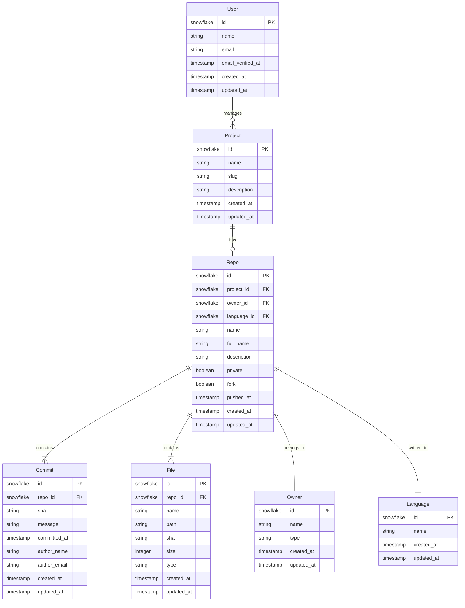

# Data Architecture

## Entity Relationship Diagram



## Model Relationships

### Project
- Has one optional repository (`hasOne(Repo::class)`)
- Belongs to many users (`belongsToMany(User::class)`)

### Repo
- Belongs to one project (`belongsTo(Project::class)`)
- Has many commits (`hasMany(Commit::class)`)
- Has many files (`hasMany(File::class)`)
- Belongs to one owner (`belongsTo(Owner::class)`)
- Belongs to one language (`belongsTo(Language::class)`)

### Commit
- Belongs to one repository (`belongsTo(Repo::class)`)

### File
- Belongs to one repository (`belongsTo(Repo::class)`)

### Owner
- Has many repositories (`hasMany(Repo::class)`)

### Language
- Has many repositories (`hasMany(Repo::class)`)

### User
- Has many projects (`hasMany(Project::class)`)

## Key Design Decisions

### Identifiers
- Using Snowflake IDs for distributed scalability
- All models use timestamps for tracking creation and updates

### Project Organization
- Projects can exist without repositories (optional relationship)
- Repositories are tied to a single project
- Files and commits are always associated with a repository

### Activity Tracking
- All models implement activity logging via Spatie's Activity Log
- Projects use slug-based routing for clean URLs

## Common Queries

### Project with Repository Info
```php
Project::with('repo')->get();
```

### Repository with All Related Data
```php
Repo::with(['project', 'commits', 'files', 'owner', 'language'])->get();
```

### User's Projects with Repositories
```php
User::with('projects.repo')->get();
```